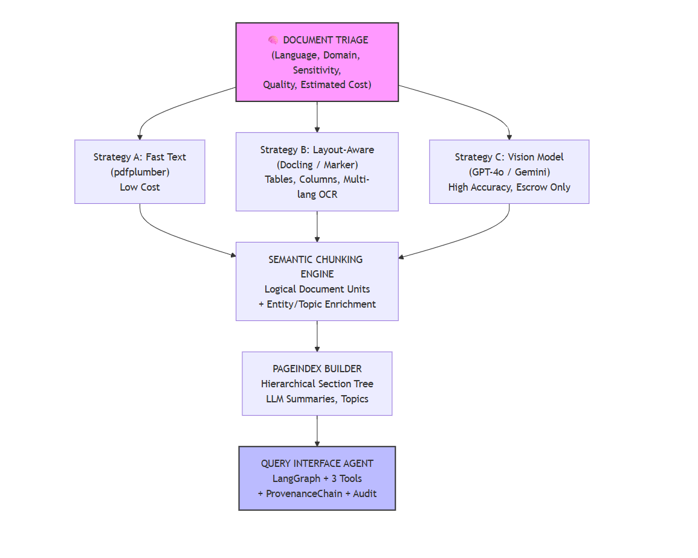

# AI Document Intelligence for Policy & Human Rights Reports in Africa

**Production‑grade, agentic document intelligence pipeline built for civic accountability.**  
Ingest heterogeneous civic documents (scanned audits, policy briefs, human rights reports) and emit **structured, queryable, explainable, and verifiable knowledge** – with full audit trails, multilingual support, and responsible AI guardrails.

[](LICENSE)
[](https://python.org)
[](https://github.com/psf/black)

---

##  The Problem: Evidence Trapped in Documents

Across Africa, Human Rights Defender (HRD) organisations, investigative journalists, and policy analysts rely on thousands of PDFs – **government audits, budget reports, legal proclamations, NGO reports, and scanned archives**. This institutional knowledge is **locked in unstructured formats** that:

- Cannot be searched efficiently,
- Cannot be queried across documents,
- Cannot provide trustworthy citations for advocacy or legal use.

Traditional OCR destroys tables and multi‑column layouts. Large Language Models hallucinate when fed raw document dumps. The result: **slow, unverifiable, and expensive manual analysis** – a bottleneck for transparency and accountability.

---

## My Solution: The Document Intelligence Refinery

We built a **5‑stage agentic pipeline** that acts as a forward‑deployed AI engineer for civic organisations.  

It turns **any PDF** (digital, scanned, multilingual, table‑heavy) into:

-  Structured JSON with exact page, section, and bounding‑box provenance
-  A navigable “smart table of contents” (PageIndex) for instant document traversal
-  A RAG‑ready vector store with semantic chunks that preserve tables, clauses, and evidence links
-  A SQL‑queryable fact database for automatic budget/expenditure comparison
-  An **audit‑mode** that can verify any claim against the original documents

Every answer is **traceable to the exact source pixel** – making AI usable for journalism, human rights reporting, and policy analysis.

---

## Architecture


---

## Key Features 
### Multi‑Strategy Extraction with Confidence‑Gated Escalation
Documents are never forced through a single pipeline. The Triage Agent profiles each document (digital/scanned, language, domain, sensitivity) and routes it to the cheapest, most appropriate extraction strategy:
- **Fast Text**: clean, single‑column policy briefs
- **Layout-Aware**: financial reports, procurement tables, multi‑column audits
- **Vision‑Augmented**: scanned government archives, low‑quality copies, handwritten notes

Every extraction is logged with confidence scores, cost estimates, and processing time. If confidence is low, the system **automatically escalates** to a more accurate method – **preventing silent failures** that could mislead fact‑checkers.

### Semantic Chunking & Logical Document Units
Naïve token‑based chunking splits tables, mangles legal clauses, and separates findings from their evidence. Our **Chunking Constitution** guarantees:
- Budget tables are never broken; repeated headers when split
- Legal clauses remain intact
- “Finding + supporting evidence” paragraphs are linked
- Cross‑references (“see Annex B”) are resolved and stored

Each chunk is enriched with automatically extracted **entities (people, organisations, locations)** and **topics (corruption, budget, health)** – turning the document into a searchable knowledge graph.

### Investigative PageIndex
A hierarchical, LLM‑summarised navigation tree that answers questions like:
> “Where are procurement irregularities mentioned?”  
> “Which section discusses public healthcare spending?”

Journalists can skip straight to the relevant pages without reading 200‑page reports.

### Complete Evidence & Accountability Chain
Every fact extracted by the system carries a **ProvenanceChain**:
```json
{
  "document_name": "Ethiopia_MoF_Budget_2024.pdf",
  "page_number": 47,
  "bbox": [72.0, 315.5, 510.0, 342.3],
  "exact_quote": "Total Healthcare Allocation: 4.2 billion Birr",
  "content_hash": "a1b2c3d4..."
}
```

This makes AI‑generated evidence court‑admissible and editor‑verifiable – a non‑negotiable requirement for human rights work.

## FactTable & Structured Querying
Numerical data (budgets, expenditures, contract amounts) from tables is automatically extracted into a local SQLite database. Policy analysts can run direct SQL queries:

```sql
SELECT description, value, year FROM facts WHERE fact_type='expenditure' AND year='2024'
No LLM hallucination – hard numbers with hard provenance.
```

## Truth Classification & Audit Mode
Every answer from the Query Agent is labelled:

- VERIFIED – directly supported by a document chunk

- INFERRED – synthesised from multiple sources, all cited

- UNVERIFIED – no supporting evidence found

Audit Mode goes further: given a claim like “The government misused road funds,” the system searches all documents, performs textual entailment, and either verifies the claim with citations or declares it unverifiable – a direct tool for disinformation counter‑check.

## Multilingual & Low‑Resource Ready

- Native support for English, French, Arabic, and Amharic (the working language of Ethiopia).

- Language detection and routing to the appropriate OCR engine or multilingual embedding model (BAAI/bge-m3).

- Pipeline runs entirely CPU‑only with Docker; cloud VLM models are optional and governed by a      strict budget cap (configurable per document). No internet required for offline deployment critical for field offices and air‑gapped environments.

## Cost‑Aware & Transparent
Every API call is tracked. A BudgetGuard prevents automated processing from exceeding a partner organisation’s monthly allowance. The extraction ledger records costs per page, per strategy, and per document – enabling full financial accountability.

## Repository Structure
```bash
.
├── src/
│   ├── models/               # Pydantic schemas (DocumentProfile, LDU, ProvenanceChain…)
│   ├── agents/               # Pipeline stages 1-5
│   │   ├── triage.py
│   │   ├── extractor.py
│   │   ├── chunker.py
│   │   ├── indexer.py
│   │   └── query_agent.py
│   ├── strategies/           # Extraction strategies A/B/C
│   ├── tools/                # Language detector, cost guard, vector store, fact table
│   └── config.py
├── rubric/
│   ├── extraction_rules.yaml # All thresholds, budget caps, civic keywords
│   └── chunking_rules.yaml   # Chunking constitution
├── .refinery/               # Generated artifacts (profiles, ledger, pageindex, DB)
├── data/corpus/             # our PDFs here
├── tests/                   # Unit tests for triage, chunker, etc.
├── docs/
│   ├── DOMAIN_NOTES.md      # Field reconnaissance, failure modes, architectural decisions
│   └── phase3/
│       └── retrieval_evaluation.csv
├── scripts/                 # Demo, batch processing, evaluation
├── Dockerfile
├── pyproject.toml
└── README.md
```
## Quick Start

### Prerequisites
Python 3.10+ or Docker

(Optional) An OpenRouter API key for VLM strategies – or run entirely offline with Ollama

### Local installation
```bash
git clone https://github.com/your-username/document-intelligence-refinery.git
cd document-intelligence-refinery
python -m venv .venv && source .venv/bin/activate
pip install -e .
```
### One‑command demo (Docker)

```bash
docker build -t refinery .
docker run -v $(pwd)/data:/app/data -v $(pwd)/.refinery:/app/.refinery refinery python scripts/demo_phase4.py
```
Place your PDFs in data/corpus/. The pipeline will automatically generate profiles, run extraction, chunk, index, and launch the query agent.

